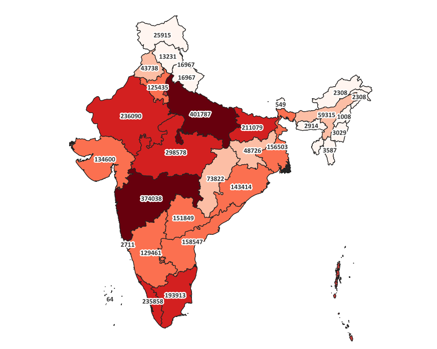

# State-wise IPC Crime Analysis of India using QGIS

A GIS dashboard analyzing the spatial distribution of cognizable IPC crimes across Indian states using QGIS 3.44 and NCRB crime statistics.
---
## Project Overview
This project visualizes and compares state-wise IPC crime statistics for India using thematic mapping techniques.
The dashboard includes:
-Total IPC Crimes (2022)
-Cime Rate (per lakh population)
-Chargesheeting Rate (2022)
-Change in IPC Crimes (2020-2022)
---
## Tools Used
-QGIS 3.44
-Microsoft Excel
-GADM Administrative Boundary
-NCRB Crime in India 2022 Dataset
---
## GIS Techniques
-Attribute Join
-Choropleth Mapping
-Field Calculator
-Natural Breaks (Jenks) Classification
-Spatial Data Visualization
-Print Layout Design
-Cartographic styling
---
## Repository Structure
'''text
data/
output/
qgis-project/
screenshots/
---
## Key Insights
-States with high crime do not always have high crime rates.
-Chargesheeting rates vary considerably across India.
-Crime trends between 2020 and 2022 differ significantly across states.
-Choropleth Mapping effectively highlights regional crime patterns.
---
## Data Sources
-National Crime Records Bureau (NCRB), Crime in India 2022
-GADM database of Global Administrative Areas
---
## Author
Priyanka Choubey
